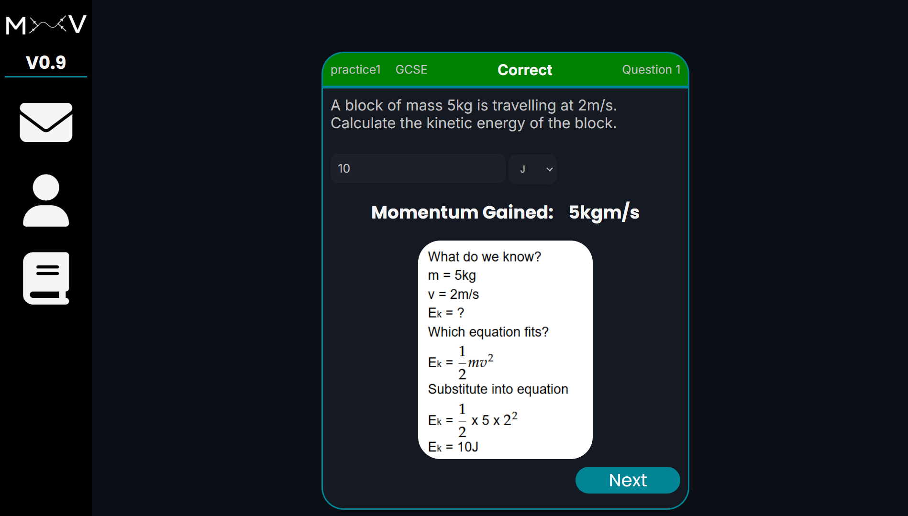

## V1.67
### A GCSE Physics revision website, centered around building confidence with maths-based problems.



# Key Features
- Hundreds of man-made questions (not really)
- Worked solutions to every question
- Stat tracking
- Topic filters
- Difficulty filters
- Real exam questions
- Leaderboards

# Local Machine Usage
You should run the file from: MxV/backend/

My typical commands are: 

```
cd MxV/backend

source .venv/bin/activate

uv run app.py
```

# Production Notice
The service I am using to host the site does not allow for outgoing SMTP transmissions.
You should log in with the details:
email: dylan08code@gmail.com
password: password

# Contribution
This is a personal project for my own development, so please do not attempt to contribute to it.

# Notices
Obviously there are not hundreds of questions, only like 10.
This is because I am one college student, who is just trying to learn.
Writing and solving a bunch of GCSE physics questions doesn't help me in any way.